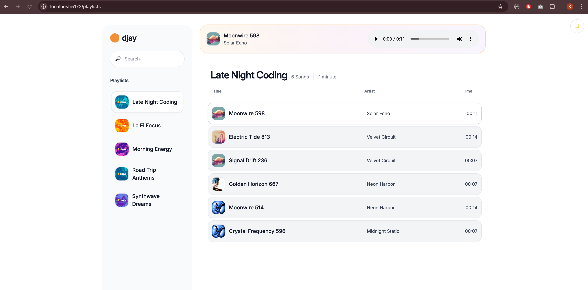
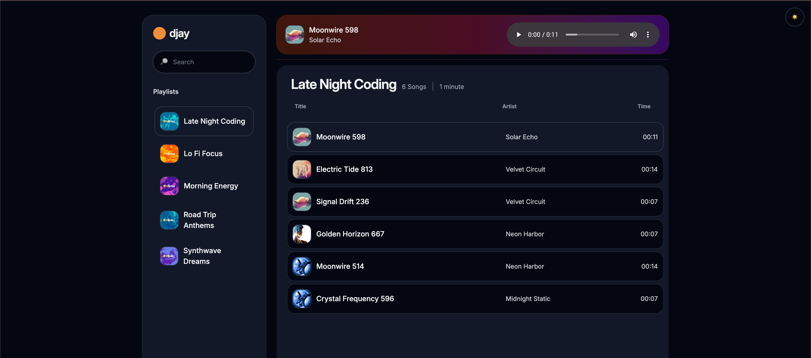

## Demo

https://drive.google.com/file/d/1GO4JcT0ftgelh8Iz5xO13nPYLlZP1DXK/view?usp=sharing

# djay-front-end

Frontend for the djay service, built with React Router and Vite.

## Prerequisites

- Node.js 20+ (Dockerfile uses Node 20)
- npm (ships with Node)


## Dev setup script
Run the Backend server locally  by folowing the instraction [here](https://github.com/khaledm1990/djay-api?tab=readme-ov-file#quick-start)

Run the setup script (checks for Node/npm, installs deps, then starts dev):

```bash
bash dev-setup.sh
```
The app will be available at `http://localhost:5173`.


## Typecheck

```bash
npm run typecheck
```

Desing

## Light Them


## Dark Them


